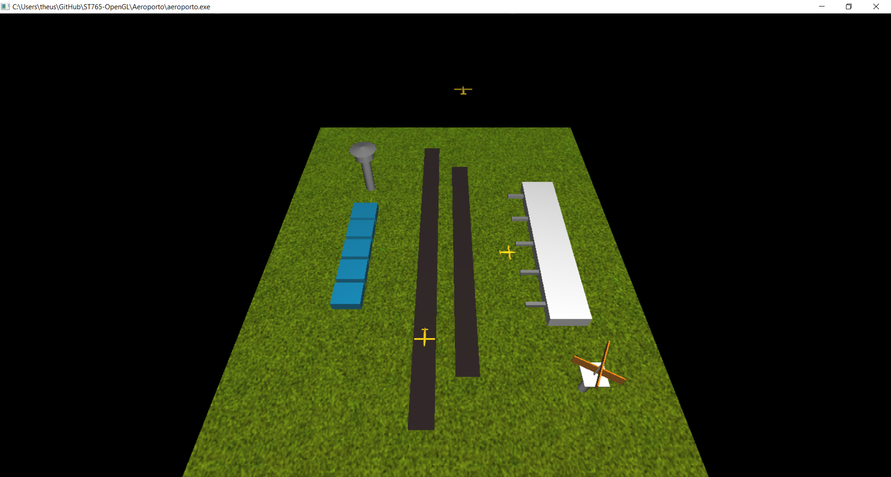
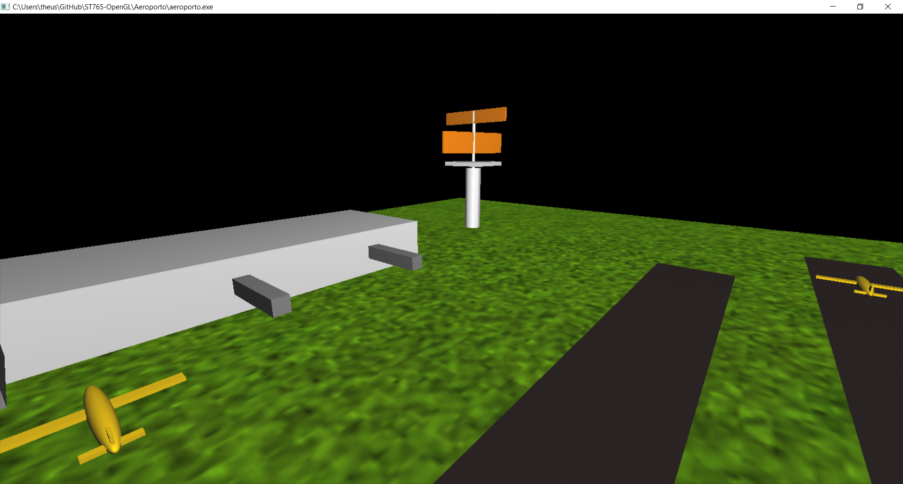
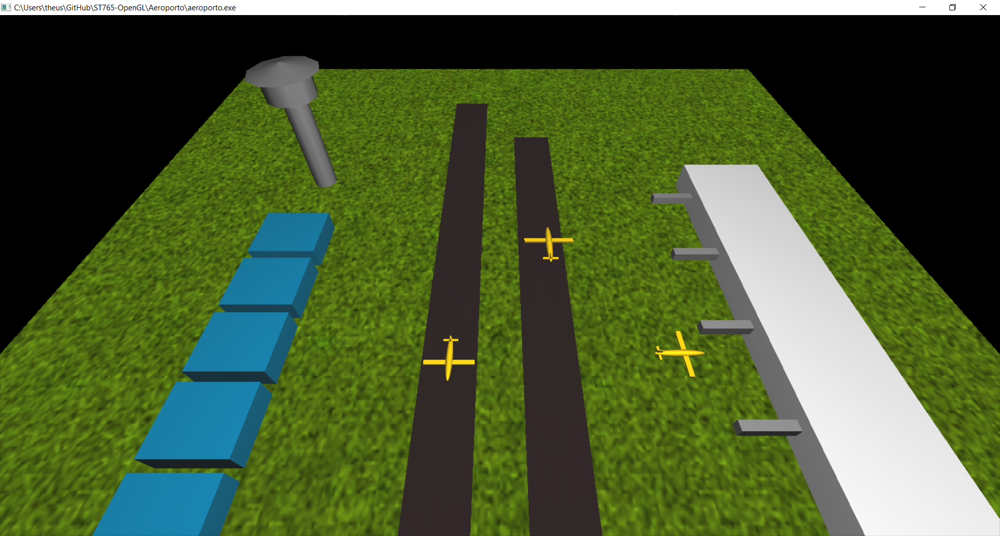
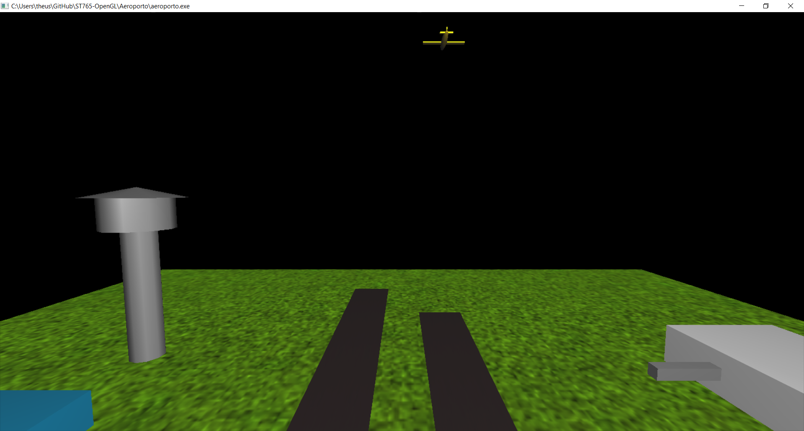
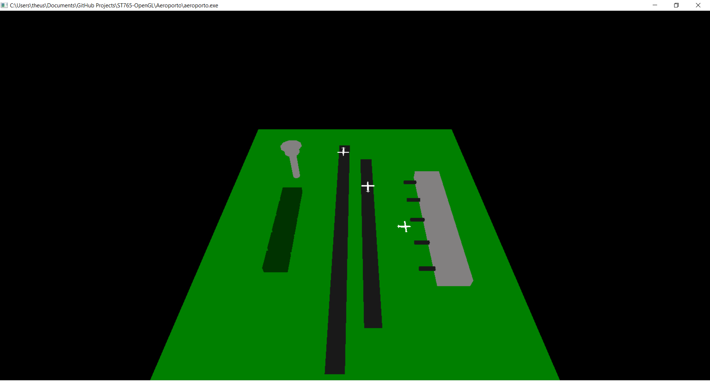
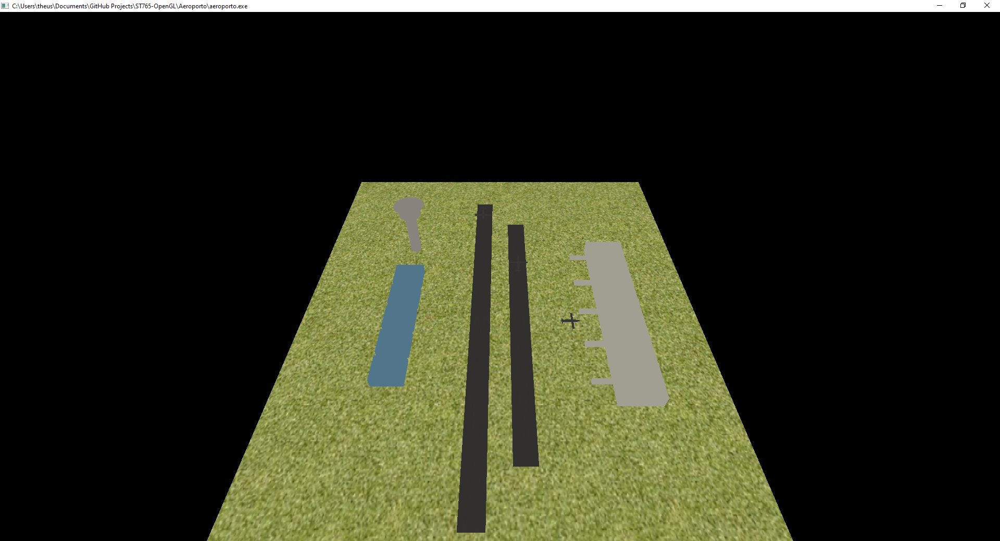
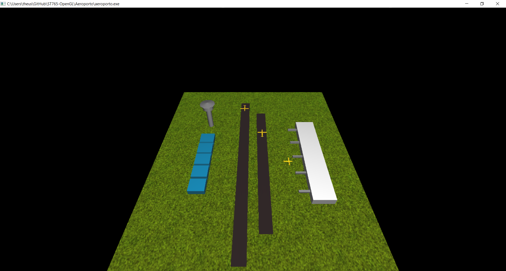
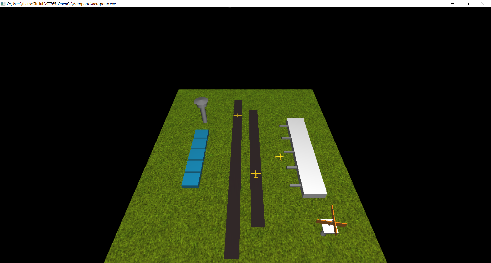

# Metadados

* **_Autor: Raphael Lira dos Santos | RA: 223865_**
* **_Autor: Matheus Percário Bruder | RA: 222327_**
* *Atualizado em: 22/06/2021*
* *Arquivo: "main.c"*
  
---
# Projeto Final - Animação Aeroporto

## Descrição

O projeto final de uma disciplina tem a intenção de congregar os vários aspectos trabalhos por vezes de forma independente no decorrer do Curso. No nosso caso e especificamente neste semestre de pandemia, teremos 2 opções de atividades que valerão com projeto final:

_1 - Na cena criada ao longo da disciplina, inserir uma animação que pode ser um avião que trafega na pista, um radar que gira etc._

__OU__

_2 - Modelar em BLENDER a cena criada no decorrer do curso. Utilize recursos de textura e iluminação._

### Explicação

Para o projeto final da disciplina de Computação Gráfica (ST765), a dupla optou por seguir em frente com o projeto utilizando o OpenGL, pois não nenhum de nós possuia experiência com Blender ou outro *software* complexo de computação gráfica. Desse modo, o objetivo do projeto final foi:

> **Objetivo:** Inserir animações no projeto Aeroporto desenvolvido no OpenGL.

Então, como trabalhamos durante alguns meses no projeto do aeroporto, até que não foi tão dificil inserir ambas as animações, ou seja:

1. Avião pousando / decolando
2. Radar girando

Assim como, vale ressaltar também que não houve modificações nos comandos de interação com a cena gráfica que eram, respectivamente, rotação e *zoom*.

* **Rotacionar no eixo X:** *W ou S;*
* **Rotacionar no eixo Y:** *A ou D;*
* **Zoom:** *Scroll do mouse.*

### Acesso ao vídeo

Obviamente que nos _prints_ abaixo não dá para ver com clareza a animação, logo, **[clique aqui](https://www.google.com.br/)** para acessar o vídeo com a animação.

### Prints da cena

| Cena gráfica | Radar em movimento | Aviões decolando / pousando | Aviões decolando |
| ------------ | ------------------ | --------------------------- | ---------------- |
|  |  |  |  |

### Evolução do projeto

Nesta seção há também a evolução da cena gráfica construída ao longo do semestre. No começo havia apenas a modelagem, logo após foi inserida textura, como também, a iluminação e por fim, a animação dos aviões e do radar.

| Modelagem | Texturização |
| --------- | ------- |
|  |  |

| Iluminação | Animação |
| ---------- | -------- |
|  |  |

---
## Código fonte

```C
#include <stdio.h>
```
