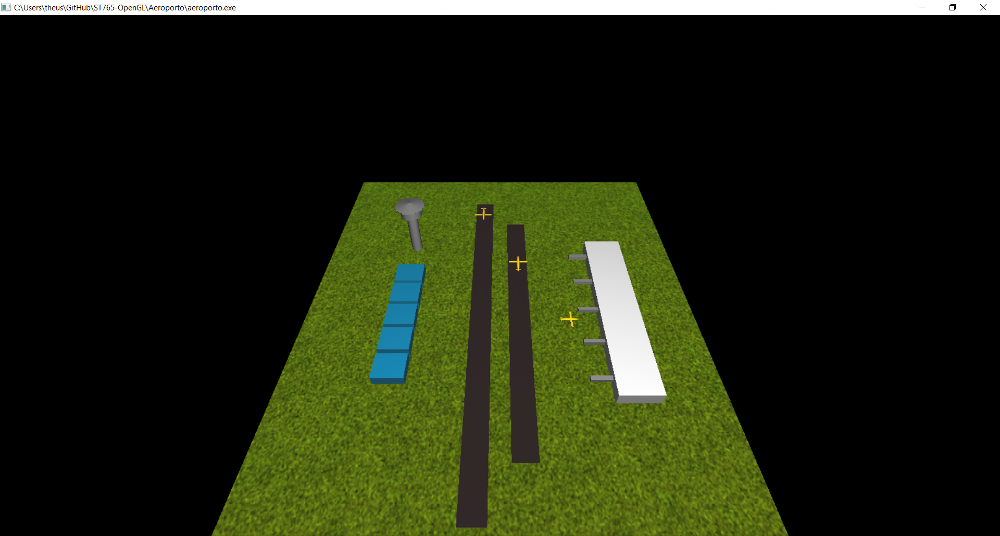
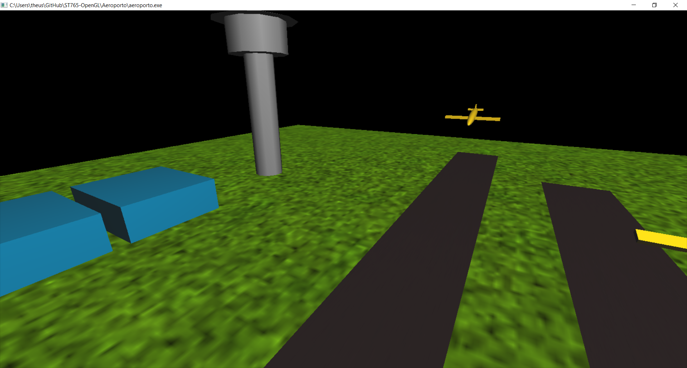

# Metadados
 * **_Autor: Raphael Lira dos Santos | RA: 223865_**
 * **_Autor: Matheus Percário Bruder | RA: 222327_**
 * *Atualizado em: 05/10/2021*
 * *Arquivo: "main.c"*

 # Projeto Aeroporto

 ## Descrição 
  Para a cena gráfica desenvolvida nos tópicos anteriores (aeroporto), acrescente o recurso de iluminação com ao menos UMA fonte luminosa. Devem ser entregues: código fonte, bibliotecas, arquivo de textura, captura da tela da cena com textura e iluminação

 ### Explicação
  Esse exercício foi um pouco mais simples que o o exercício anterior, isto é, colocar o código de uma fonte luminosa foi relativamente mais fácil, porém, quebramos a cabeça para atingir um resultado satisfatório, ou seja, para que a iluminação se comportasse de fato como deveria.

  Vale ressaltar também que não houve modificações nos comandos de interação com a cena gráfica que eram, respectivamente, rotação e *zoom*.

 - **Rotacionar no eixo X:** *W ou S;*
 - **Rotacionar no eixo Y:** *A ou D;*
 - **Zoom:**  *Scroll do mouse.*
  

 ### Prints da cena:
 | Sem iluminaçao | Com iluminação | Com Zoom Iluminação da Torre | 
 | ----------------------------------------------- | ----------------------------------------------- | --------------------------------------------- | 
 |  |  |  | 

 ---
 ## Código fonte

 ```C
#include <stdio.h>
#include <stdlib.h>
#include <windows.h>
#include <GL/gl.h>
#include <GL/glext.h>
#include <GL/glut.h>
#include "image.h"

/**
 *  Medidas dadas em Metros
 */
#define CHAO_ALTURA 0.1

#define AVIAO_TRANSLACAO_X -100.0
#define AVIAO_TRANSLACAO_Y -50.0
#define AVIAO_TRANSLACAO_Z -700.0
#define CHAO_ESCALONAMENTO_X 2000.0
#define CHAO_ESCALONAMENTO_Z 2500.0
#define PISTA_TRANSLACAO_Y 0.0
#define PISTA_TRANSLACAO_Z 0.0 
#define PISTA_ESCALONAMENTO_X 100.0
#define PISTA_ESCALONAMENTO_Y 0.2
#define GALPAO_ESCALONAMENTO_X 150.0
#define GALPAO_ESCALONAMENTO_Y 50.5
#define GALPAO_ESCALONAMENTO_Z 130.0
#define GALPAO_TRANSLACAO_X -500
#define GALPAO_ESPACAMENTO 20
#define PORTOES_ESCALONAMENTO_X 200.0
#define PORTOES_ESCALONAMENTO_Y 70.0
#define PORTOES_ESCALONAMENTO_Z 1000.0
#define PORTOES_TRANSLACAO_X 600.0
#define PORTAO_ESCALONAMENTO_X 100
#define PORTAO_ESCALONAMENTO_Y 20
#define PORTAO_ESCALONAMENTO_Z 20
#define PORTAO_TRANSLACAO_X PORTOES_TRANSLACAO_X - (PORTOES_ESCALONAMENTO_X/2) - (PORTAO_ESCALONAMENTO_X/2)
#define TORRE_CONTROLE_BASE_RAIO 30
#define TORRE_CONTROLE_BASE_ALTURA 250
#define TORRE_CONTROLE_BASE_SLICES 10
#define TORRE_CONTROLE_BASE_STACKS 10
#define TORRE_CONTROLE_BASE_TRANSLACAO_X GALPAO_TRANSLACAO_X
#define TORRE_CONTROLE_BASE_TRANSLACAO_Z 0.0
#define TORRE_CONTROLE_CABINE_RAIO 60
#define TORRE_CONTROLE_CABINE_ALTURA 60
#define TORRE_CONTROLE_CABINE_SLICES 10
#define TORRE_CONTROLE_CABINE_STACKS 10
#define TORRE_CONTROLE_CABINE_TRANSLACAO_X TORRE_CONTROLE_BASE_TRANSLACAO_X
#define TORRE_CONTROLE_CABINE_TRANSLACAO_Z 0.0  
#define TORRE_CONTROLE_TELHADO_ALTURA 20.0 
#define TORRE_CONTROLE_TELHADO_MARGEM 1.4

#define COORD_TEXTURE 1.0
 
//TEXTURAS
#define TEX_ASFALTO "tex/asfalto.sgi"
#define TEX_GRAMA "tex/grass.sgi"


GLfloat planotext[4][2]={
  {-COORD_TEXTURE,-COORD_TEXTURE},
  {+COORD_TEXTURE,-COORD_TEXTURE},
  {+COORD_TEXTURE,+COORD_TEXTURE},
  {-COORD_TEXTURE,+COORD_TEXTURE}
};


static int rotx = 45;
static int roty = 0;

static float zoom = -1500.0;

GLuint textura_asfalto;
GLuint textura_grama;

void carregar_textura(char * caminho, GLuint * textura, int n){
  IMAGE *img;
  GLenum gluerr;

  /* textura do plano */
  glGenTextures(n, textura);
  glBindTexture(GL_TEXTURE_2D, * textura);
  
  if(!(img=ImageLoad(caminho))) {
    //printf("Error reading a texture.\n");
    exit(-1);
  }

  gluerr=gluBuild2DMipmaps(GL_TEXTURE_2D, 3, 
			   img->sizeX, img->sizeY, 
			   GL_RGB, GL_UNSIGNED_BYTE, 
			   (GLvoid *)(img->data));
  if(gluerr){
    //printf("GLULib%s\n",gluErrorString(gluerr));
    exit(-1);
  }

  glTexParameterf(GL_TEXTURE_2D,GL_TEXTURE_WRAP_S,GL_REPEAT);
  glTexParameterf(GL_TEXTURE_2D,GL_TEXTURE_WRAP_T,GL_REPEAT);
  glTexParameterf(GL_TEXTURE_2D,GL_TEXTURE_MIN_FILTER,GL_LINEAR_MIPMAP_LINEAR);
  glTexParameterf(GL_TEXTURE_2D,GL_TEXTURE_MAG_FILTER,GL_LINEAR);
  glTexEnvf(GL_TEXTURE_ENV, GL_TEXTURE_ENV_MODE, GL_DECAL);
}


// ILUMINACAO
GLfloat chao_difusa[]    = { 0.2, 1.0, 0.0, 0.5 };
GLfloat chao_especular[] = { 0.5, 1.0, 0.0, 0.0 };
GLfloat chao_brilho[]    = { 0.1 };

GLfloat pista_difusa[]    = { 0.0, 0.0, 0.0, 0.0 };
GLfloat pista_especular[] = { 0.15, 0.1, 0.1, 0.21 };
GLfloat pista_brilho[]    = { 0.5 };

GLfloat torre_difusa[]    = { 0.5, 0.5, 0.5, 1.0 };
GLfloat torre_especular[] = { 0.5, 0.5, 0.5, 0.0 };
GLfloat torre_brilho[]    = { 50.0 };

GLfloat galpao_difusa[]    = { 0.0, 0.5, 0.7, 1.0 };
GLfloat galpao_especular[] = { 0.0, 0.0, 0.7, 0.0 };
GLfloat galpao_brilho[]    = { 50.0 };

GLfloat portao_difusa[]    = { 1.0, 1.0, 1.0, 1.0 };
GLfloat portao_especular[] = { 1.0, 1.0, 1.0, 0.0 };
GLfloat portao_brilho[]    = { 50.0 };

GLfloat portao_embarque_difusa[]    = { 0.5, 0.5, 0.5, 1.0 };
GLfloat portao_embarque_especular[] = { 0.5, 0.5, 0.5, 0.0 };
GLfloat portao_embarque_brilho[]    = { 50.0 };

GLfloat aviao_difusa[]    = { 1.0, 0.8, 0.0, 0.5 };
GLfloat aviao_especular[] = { 1.0, 0.8, 0.0, 1.0 };
GLfloat aviao_brilho[]    = { 50.0 };

GLfloat posicao_luz[]    = { 150.0, 250.0, 100.0, 1.0}; // DISTANTE (SOL)
GLfloat cor_luz[]        = { 1.0, 1.0, 1.0, 1.0};
GLfloat cor_luz_amb[]    = { 0.3, 0.3, 0.3, 1.0};

/**
 * Desenha cada portõa de embarque
 *
 * @param quantidades_portoes recebe a quantidade de portões que serão criados para garantir o espaçamento
 * @param portão o número do portão pelo qual será impresso
 */
void desenhar_portao_embarque(int quantidades_portoes, int portao){
  glPushMatrix();
  
  /* propriedades do material 5 - Portao */
  glMaterialfv(GL_FRONT_AND_BACK, GL_DIFFUSE, portao_embarque_difusa);
  glMaterialfv(GL_FRONT_AND_BACK, GL_SPECULAR, portao_embarque_especular);
  glMaterialfv(GL_FRONT_AND_BACK, GL_SHININESS, portao_embarque_brilho);
  
  glColor3f(0.1f, 0.1f, 0.1f);//Dark grey

  // translação de Y
  float t_z = 
  	((PORTOES_ESCALONAMENTO_Z/quantidades_portoes) * portao) 
  		- ((quantidades_portoes/2) * (PORTOES_ESCALONAMENTO_Z/quantidades_portoes));

  glTranslatef (PORTAO_TRANSLACAO_X, CHAO_ALTURA + (PORTOES_ESCALONAMENTO_Y/2), t_z);
  glScalef (PORTAO_ESCALONAMENTO_X, PORTAO_ESCALONAMENTO_Y, PORTAO_ESCALONAMENTO_Z);
  glutSolidCube (1.0);

  glPopMatrix();
}


/**
 * Desenha a torre de controle
 *
 * @param quantidade_galpoes recebe a quantidade de galpoes criados para gerar espaçaamento necessário para deixar a torre de lado
 */
void desenhar_torre_controle(int quantidade_galpoes){

  GLUquadric *quadObj = gluNewQuadric();

  glPushMatrix();
  
  /* propriedades do material 3 - Torre*/
  glMaterialfv(GL_FRONT_AND_BACK, GL_DIFFUSE, torre_difusa);
  glMaterialfv(GL_FRONT_AND_BACK, GL_SPECULAR, torre_especular);
  glMaterialfv(GL_FRONT_AND_BACK, GL_SHININESS, torre_brilho);
  
  // base da torre
  float 
  	t_z = - ((quantidade_galpoes/2) * (GALPAO_ESCALONAMENTO_Z * 2));
  
  glTranslatef (
	  (GLfloat) TORRE_CONTROLE_BASE_TRANSLACAO_X, 
	  (GLfloat) (CHAO_ALTURA + (TORRE_CONTROLE_BASE_ALTURA)), 
	  (GLfloat) t_z
  );
  glRotatef ((GLfloat) 90, 1.0, 0.0, 0.0);

  gluCylinder(
      quadObj,
  	  (GLdouble) TORRE_CONTROLE_BASE_RAIO,
  	  (GLdouble) TORRE_CONTROLE_BASE_RAIO,
	  (GLdouble) TORRE_CONTROLE_BASE_ALTURA,
	  (GLint) TORRE_CONTROLE_BASE_SLICES,
	  (GLint) TORRE_CONTROLE_BASE_STACKS
  );
  
  glPopMatrix(); 
  
  // base onde fica os controladores
  glPushMatrix();  
  glTranslatef (
	  (GLfloat) TORRE_CONTROLE_CABINE_TRANSLACAO_X, 
	  (GLfloat) (CHAO_ALTURA + TORRE_CONTROLE_CABINE_ALTURA + TORRE_CONTROLE_BASE_ALTURA) , 
	  (GLfloat) t_z
  );
  glRotatef ((GLfloat) 90, 1.0, 0.0, 0.0);
  glutSolidCylinder(
  	  (GLdouble) TORRE_CONTROLE_CABINE_RAIO,
	  (GLdouble) TORRE_CONTROLE_CABINE_ALTURA,
	  (GLint) TORRE_CONTROLE_CABINE_SLICES,
	  (GLint) TORRE_CONTROLE_CABINE_STACKS
  );

  glPopMatrix();
  
  // telhado
  glPushMatrix();  
  glTranslatef (
	  (GLfloat) TORRE_CONTROLE_CABINE_TRANSLACAO_X, 
	  (GLfloat) (CHAO_ALTURA + TORRE_CONTROLE_CABINE_ALTURA + TORRE_CONTROLE_BASE_ALTURA) , 
	  (GLfloat) t_z
  );
  glRotatef ((GLfloat) -90, 1.0, 0.0, 0.0);
  glutSolidCone(
  	  (GLdouble) TORRE_CONTROLE_CABINE_RAIO * TORRE_CONTROLE_TELHADO_MARGEM,
	  (GLdouble) TORRE_CONTROLE_TELHADO_ALTURA,
	  (GLint) TORRE_CONTROLE_CABINE_SLICES,
	  (GLint) TORRE_CONTROLE_CABINE_STACKS
  );	

  glPopMatrix();
}


/**
 * Desenha os portões onde haverá cada portão de embarque
 */
void desenhar_portoes(){
  
  glPushMatrix();
  
  /* propriedades do material 5 - Portao */
  glMaterialfv(GL_FRONT_AND_BACK, GL_DIFFUSE, portao_difusa);
  glMaterialfv(GL_FRONT_AND_BACK, GL_SPECULAR, portao_especular);
  glMaterialfv(GL_FRONT_AND_BACK, GL_SHININESS, portao_brilho);
  
  glTranslatef (PORTOES_TRANSLACAO_X, CHAO_ALTURA + (PORTOES_ESCALONAMENTO_Y/2), 0.0);
  glScalef (PORTOES_ESCALONAMENTO_X, PORTOES_ESCALONAMENTO_Y, PORTOES_ESCALONAMENTO_Z);
  glutSolidCube(1.0);
  
  glPopMatrix();
  
  int
  	i, 
  	quantidade_portoes = 5;// deixei 5 por default, mas poderá ser mudado para quantos quiser
  
  for(i=0;i<quantidade_portoes;i++){
  	desenhar_portao_embarque(quantidade_portoes,i);
  }  
}

/**
 * Desenha um galpão de acordo com os parâmetros
 * 
 * @param t_x faz a translação do eixo X
 * @param t_y faz a translação do eixo Y
 * @param t_z faz a translação do eixo Z
 */
void desenhar_galpao(int quantidade_galpoes, int galpao){
  
  // translação de Y
  float t_z = ((GALPAO_ESCALONAMENTO_Z + GALPAO_ESPACAMENTO) * galpao) - ((quantidade_galpoes/2) * GALPAO_ESCALONAMENTO_Z);
  
  // Desenha o galpão
  glPushMatrix(); 
  
  /* propriedades do material 4 - Galpao */
  glMaterialfv(GL_FRONT_AND_BACK, GL_DIFFUSE, galpao_difusa);
  glMaterialfv(GL_FRONT_AND_BACK, GL_SPECULAR, galpao_especular);
  glMaterialfv(GL_FRONT_AND_BACK, GL_SHININESS, galpao_brilho);
  
  glTranslatef (GALPAO_TRANSLACAO_X, CHAO_ALTURA + (GALPAO_ESCALONAMENTO_Y/2), t_z);
  glScalef (GALPAO_ESCALONAMENTO_X, GALPAO_ESCALONAMENTO_Y, GALPAO_ESCALONAMENTO_Z);
  glutSolidCube (1.0);
  
  glPopMatrix();
}

/**
 * Desenha uma pista de acordo com os parâmetros
 * 
 * @param t_x faz a translação do eixo X
 * @param e_z faz o escalonamento do eixto Z
 */
void desenhar_pista(float t_x, float e_z){
  glPushMatrix();
  
  glTranslatef (t_x, PISTA_TRANSLACAO_Y + 0.5, PISTA_TRANSLACAO_Z);
  glScalef (PISTA_ESCALONAMENTO_X, PISTA_ESCALONAMENTO_Y, e_z);
  glutSolidCube (1.0);

  glPopMatrix();
}

/**
 * Desenha o chao da cena de acordo com os parâmetros
 */
void desenhar_chao(){
  glPushMatrix();
  
  glScalef (CHAO_ESCALONAMENTO_X, CHAO_ALTURA, CHAO_ESCALONAMENTO_Z);
  glutSolidCube (1.0);
  
  glPopMatrix();  
}

void tex_grama(){
	
  glPushMatrix();
  
  /* propriedades do material 1 - Chao*/
  glMaterialfv(GL_FRONT_AND_BACK, GL_DIFFUSE, chao_difusa);
  glMaterialfv(GL_FRONT_AND_BACK, GL_SPECULAR, chao_especular);
  glMaterialfv(GL_FRONT_AND_BACK, GL_SHININESS, chao_brilho);
  
  glTexEnvf(GL_TEXTURE_ENV, GL_TEXTURE_ENV_MODE, GL_BLEND);
  glBindTexture(GL_TEXTURE_2D, textura_grama);
  
  /* habilita~desabilita uso de texturas*/
  glEnable(GL_TEXTURE_2D);
  glBegin(GL_QUADS);
  glTexCoord2fv(planotext[0]);  glVertex3f(-1000,CHAO_ALTURA,1250);
  glTexCoord2fv(planotext[1]);  glVertex3f(1000,CHAO_ALTURA,1250);
  glTexCoord2fv(planotext[2]);  glVertex3f(1000,CHAO_ALTURA,-1250);
  glTexCoord2fv(planotext[3]);  glVertex3f(-1000,CHAO_ALTURA,-1250);
  glEnd();
  
  glDisable(GL_TEXTURE_2D);
  
  glPopMatrix();
}

void tex_asfalto(){
  /* propriedades do material 2 - Pista*/  
  glPushMatrix();
  
  glMaterialfv(GL_FRONT_AND_BACK, GL_DIFFUSE, pista_difusa);
  glMaterialfv(GL_FRONT_AND_BACK, GL_SPECULAR, pista_especular);
  glMaterialfv(GL_FRONT_AND_BACK, GL_SHININESS, pista_brilho);
  
  glTexEnvf(GL_TEXTURE_ENV,GL_TEXTURE_ENV_MODE,GL_BLEND);
  glBindTexture(GL_TEXTURE_2D, textura_asfalto);
  
  
  
  /* habilita~desabilita uso de texturas*/
  glEnable(GL_TEXTURE_2D);
  
  glBegin(GL_QUADS);
  glTexCoord2fv(planotext[0]);  glVertex3f(-55-100,1,970);
  glTexCoord2fv(planotext[1]);  glVertex3f(55-100,1,970);
  glTexCoord2fv(planotext[2]);  glVertex3f(55-100,1,-970);
  glTexCoord2fv(planotext[3]);  glVertex3f(-55-100,1,-970);
  glEnd();
  
  glBegin(GL_QUADS);
  glTexCoord2fv(planotext[0]);  glVertex3f(-55+100,1,750);
  glTexCoord2fv(planotext[1]);  glVertex3f(55+100,1,750);
  glTexCoord2fv(planotext[2]);  glVertex3f(55+100,1,-750);
  glTexCoord2fv(planotext[3]);  glVertex3f(-55+100,1,-750);
  glEnd();
  
  glDisable(GL_TEXTURE_2D);
  
  glPopMatrix();
}

/**
 * Desenha o aviao
 *
 * @param rot_x faz a rotacao no eixo X (pousando / decolando)
 * @param rot_y faz a rotacao no eixo Y
 * @param t_x faz a translação do eixo X
 * @param t_y faz a translação do eixo Y
 * @param t_z faz a translação do eixo Z
 */
void desenhar_aviao(int rot_x, int rot_y, float t_x, float t_y, float t_z){
	
  glPushMatrix();
  
  /* propriedades do material 6 - Aviao */
  glMaterialfv(GL_FRONT_AND_BACK, GL_DIFFUSE, aviao_difusa);
  glMaterialfv(GL_FRONT_AND_BACK, GL_SPECULAR, aviao_especular);
  glMaterialfv(GL_FRONT_AND_BACK, GL_SHININESS, aviao_brilho);
  
  glColor4f(1.0f, 1.0f, 1.0f, 0.0f);//white
  
  // rotacao do aviao 
  glRotatef (rot_x, 1.0, 0.0, 0.0);
  glRotatef (rot_y, 0.0, 1.0, 0.0);
  
	
  // Esfera -> corpo do corpo
  glPushMatrix();
  glTranslatef (t_x, t_y, t_z);
  glScalef (1.0, 1.0, 7.0);
  glutSolidSphere (7.0, 16, 16);
  glPopMatrix();
  
  // Asas tras
  glPushMatrix();
  glTranslatef (t_x, t_y, t_z - 40);
  glScalef (30.0, 3.0, 5.0);
  glutSolidCube (1.0);
  glPopMatrix();
  
  // Asas frente
  glPushMatrix();
  glTranslatef (t_x, t_y, t_z + 10);
  glScalef (100.0, 3.0, 10.0);
  glutSolidCube (1.0);
  glPopMatrix();
  
  // Asas (em pe)
  glPushMatrix();
  glTranslatef (t_x, t_y + 7, t_z - 40);
  glScalef (2.0, 7.0, 10.0);
  glutSolidCube (1.0);
  glPopMatrix();
  
  glPopMatrix();
}

void display(void){
	
  glClear(GL_COLOR_BUFFER_BIT | GL_DEPTH_BUFFER_BIT);
  glEnable(GL_LIGHTING);
  glClearColor (0.0, 0.0, 0.0, 0.0);
  
  glShadeModel(GL_SMOOTH);
  
  glPushMatrix();

  glRotatef ((GLfloat) rotx, 1.0, 0.0, 0.0);
  glRotatef ((GLfloat) roty, 0.0, 1.0, 0.0);
  
  glTranslatef (0.0, zoom, zoom);
  
  // Textura grama
  tex_grama();
  
  // Textura grama
  tex_asfalto();
  
  // galpões/hagares
  int 
  	qtd_galpoes = 5,
  	i;  

  // Onde ficara a torre de controle
  desenhar_torre_controle(qtd_galpoes);
  
  for(i= 0; i < qtd_galpoes; i++){
  	desenhar_galpao(qtd_galpoes, i);
  }
  
  // Chao da cena gráfica
  //desenhar_chao(); // TEXTURA
  
  // congonhas tem duas pistas:
  // 1940x45 e 1495x45  
  //desenhar_pista(-100.0,1940.0); // TEXTURA
  //desenhar_pista(100.0,1495.0); // TEXTURA

  
  // Portoes onde ficarao os portoes de embarque
  desenhar_portoes();
  
  
  // aviao pousando
  desenhar_aviao(15, 0, -100.0, -50.0, -700.0); 
  
  // aviao decolando
  desenhar_aviao(20, 180, -100, -10.0, 300.0); 
  
  // aviao portao de embarque
  desenhar_aviao(0, 90, -50.0, PORTAO_ESCALONAMENTO_Y, 350.0); 

  glPopMatrix();
  glutSwapBuffers();
}

void reshape (int w, int h){
  glViewport (0, 0, (GLsizei) w, (GLsizei) h);
  glMatrixMode (GL_PROJECTION);
  glLoadIdentity ();
  gluPerspective(65.0, (GLfloat) w/(GLfloat) h, 1.0, 5000.0);
  glMatrixMode(GL_MODELVIEW);
  glLoadIdentity();
  glTranslatef (0.0, -200.0, 0.0);
}

void keyboard(unsigned char key, int x, int y){
		
  switch (key) {
  case 'a':
  case 'A':
    roty = (roty - 5) % 360;
    glutPostRedisplay();
    break;
  case 'd':
  case 'D':
    roty = (roty + 5) % 360;
    glutPostRedisplay();
    break;
   case 'w':
   case 'W':
    rotx = (rotx - 5) % 360;
    glutPostRedisplay();
    break;
  case 's':
  case 'S':
    rotx = (rotx + 5) % 360;
    glutPostRedisplay();
    break;
  case 27:                                         // tecla Esc (encerra o programa)
	exit(0);
	break;
  }
}

void mouse(int button, int state, int x, int y){
	if (state == GLUT_DOWN) {
	    switch(button) {
		// Button 3 == SCROLL UP and Button 4  == SCROLL DOWN
	    case 3:
	      zoom += 30.0;
	      glutPostRedisplay();
	      break;
	    case 4:
	      zoom -= 30.0;
	      glutPostRedisplay();
	      break;
	    default:
	      break;
	    }
	  }
}

void init(void){
  glClearColor (0.0, 0.0, 0.0, 0.0);
  
  carregar_textura(TEX_ASFALTO,&textura_asfalto,1);
  carregar_textura(TEX_GRAMA,&textura_grama,1);
  
  glEnable(GL_DEPTH_TEST);
  
  // ILUMINACAO
  glLightfv(GL_LIGHT0, GL_DIFFUSE, cor_luz);
  glLightfv(GL_LIGHT0, GL_SPECULAR, cor_luz);
  glLightfv(GL_LIGHT0, GL_AMBIENT, cor_luz_amb);
  glLightfv(GL_LIGHT0, GL_POSITION, posicao_luz); // DISTANTE (SOL)
  
  glEnable(GL_LIGHTING);
  glEnable(GL_LIGHT0);

  glEnable(GL_AUTO_NORMAL);
  glEnable(GL_NORMALIZE);
}

int main(int argc, char** argv){
  glutInit(&argc, argv);
  glutInitDisplayMode (GLUT_DOUBLE | GLUT_RGB | GLUT_DEPTH);
  glutInitWindowSize (500, 500); 
  glutInitWindowPosition (100, 100);
  glutCreateWindow (argv[0]);
  init ();
  glutDisplayFunc(display); 
  glutReshapeFunc(reshape);
  glutKeyboardFunc(keyboard);
  glutMouseFunc(mouse);
  glutMainLoop();
  return 0;
}
 ```
