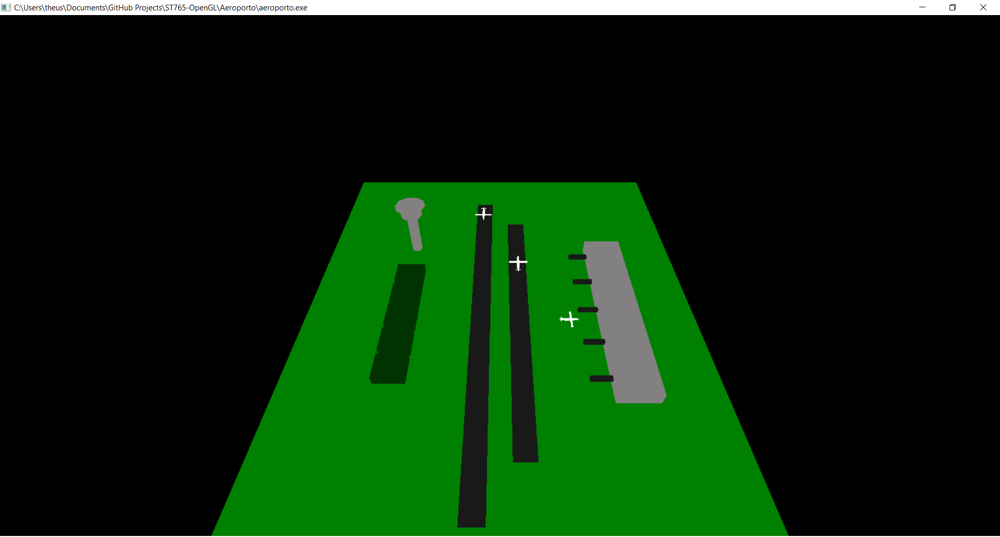

# Metadados
 * **_Autor: Raphael Lira dos Santos | RA: 223865_**
 * **_Autor: Matheus Percário Bruder | RA: 222327_**
 * *Atualizado em: 15/05/2021*
 * *Arquivo: "main.c"*

 # Projeto Aeroporto

 ## Descrição 
  Para a cena gráfica desenvolvida nos tópicos anteriores (aeroporto), acrescente ao menos UM arquivo de textura. A textura poderá ser uma simulação da pista de pouso, placa de um hangar, letreiro no aeroporto  etc. Devem ser entregues: código fonte, bibliotecas, arquivo de textura, captura da tela da cena com textura.

  **Observação:** *Tenha também em mente que este exercício será a base para o exercício seguinte em que a iluminação será adicionada na cena.*


 ### Explicação
  Esse exercício nos deu um pouco de trabalho extra e algumas horas quebrando a cabeça... Veja mais abaixo o comparativo entre nossa cena antes e depois de inserirmos a textura.

  Vale ressaltar também que não houve modificações nos comandos de interação com a cena gráfica que eram, respectivamente, rotação e *zoom*.

 - **Rotacionar no eixo X:** *W ou S;*
 - **Rotacionar no eixo Y:** *A ou D;*
 - **Zoom:**  *Scroll do mouse.*
  

 ### Prints da cena:
 | Sem textura                                     | Com Textura                                   |
 | ----------------------------------------------- | --------------------------------------------- |
 |  |  |

 ---
 ## Código fonte

 ```C
    #include<stdlib.h>
    #include <windows.h>
    #include <GL/gl.h>
    #include <GL/glext.h>
    #include<GL/glut.h>
    #include "image.h"

    /**
     *  Medidas dadas em Metros
     */
 ```