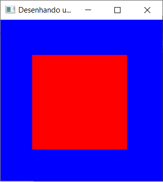

# Metadados
 * **_Author: Raphael Lira dos Santos | RA: 223865_**
 * **_Author: Matheus Percário Bruder | RA: 222327_**
 * *Created at: 25/03/2021*
 * *File: "linha.cpp"*

 ## Exercício 01 - Linha.c
  Esse exercício tinha como objetivo a familiarização com o DEV e OpenGL. Ou seja, deveríamos manipular o código pronto disponibilizado pelo professor para atingir o resultados das questões a seguir:

  ---
  ### Questão 01 - Substitua as coordenadas do ponto (200, 10) por (400, 10). O que acontece? Justifique.
  Ao substituir as coordenadas do segundo ponto de (200, 10) para (400, 20) as referências X e Y do ponto são alteradas, logo, o ponto é deslocado de posição fazendo com que a inclinação da linha mude.
  Contudo, há um problema nessa alteração, pois a janela criada possui uma resolução de 256x256, ou seja, ao mudar a coordenada X de 200 para 400 ultrapassamos a dimensão horizontal da janela. Veja imagens comparativas abaixo:

  | Antes                                             | Depois                                            |
  | ------------------------------------------------- | ------------------------------------------------- |
  |                |                |
  
  ---
  ### Questão 02 - Como alterar a cor de fundo da janela gráfica de branca para azul? Apresente o comando.
  Para alterar o fundo da janela gráfica devemos alterar o comando `glClearColor` que está dentro da função init. Esse comando possui 4 atributos, em que, os três primeiros representam, respectivamente, as intensidade de vermelho (R), verde (G) e azul (B). Além disso, o quarto e último argumento é o "alfa", que existe para gerar a transparência. 
  Todos variam entre 0 e 1. Portanto, para alterar o fundo para azul, utilizaríamos o seguinte comando:
  
  `glClearColor(0.0, 0.0, 1.0, 1.0);`
  
  Gerando o resultado:
  
  

  ---
  ### Questão 03 - Desenhe um quadrado a partir da junção de 4 linhas. Apresente o trecho de código. Na sequência, desenhe um quadrado similar (mesmo valor de lado) por meio da substituição de `glBegin(GL_LINES);` por `glBegin(GL_QUADS);`.
  Para desenhar um quadrado, obviamente são necessários quatro pontos ao invés de dois, além disso, esses pontos devem ser equidistantes entre si nas componentes X e Y. Vale lembrar que cada ponto é criado a partir do comando `glVertex2i` que está dentro da função display.
  Assim sendo, com o intuito de simplificar a visualização, optamos por gerar um quadrado de 150 pixels de largura, logo os seguintes pontos foram criados:

  ```C++
    glVertex2i(50, 200); glVertex2i(200, 200);   // LINHA CIMA
    glVertex2i(50, 50);  glVertex2i(200, 50);    // LINHA BAIXO
    glVertex2i(200, 50); glVertex2i(200, 200);   // LADO DIREITO
    glVertex2i(50, 50);  glVertex2i(50, 200);    // LADO ESQUERDO
  ```
  O resultado gerado pelas linhas acima foi:
  

  Para finalizar, agora devemos substituir o comando `glBegin(GL_LINES);` por `glBegin(GL_QUADS);`, gerando o resultado:
  
  

  ---
  ### Questão 04 - Qual comando deve ser utilizado, e em que posição devo incluí-lo, para preencher o quadrado com a cor vermelho?
  Para preencher o quadrado com a cor vermelho (red), deve-se alterar a *função* `glColor3f`, modificando seus respectivos parâmetros para: `glColor3f(1, 0, 0)`, que são respectivamente, vermelho (R), verde (G), azul (B).

  

  
  O trecho de código onde é realizado esta operação, pode ser observado na linha `34`. Dentro da função `void display(void)` e logo após o comando `glClear(GL_COLOR_BUFFER_BIT);` que realiza a limpeza da janela.


  ----
  ### Questão 05 - Qual tecla deve ser escolhida para encerrar o programa? Altere esse trecho de código de modo que o programa seja encerrado teclando “e” ou “E”.
  O código original, conta com a tecla `esc`(27) para encerrar o programa, assim para funcionar com as teclas `e`(101) e `E`(69), foi necessario adicionar ao `case` do `switch` tais condições (segue o código e na imagem abaixo das linhas 42 à 51).

  ```C++
  void keyboard(unsigned char key, int x, int y){
    switch (key) {
    case 69: 
    case 101: 
    case 27:
      exit(0);
      break;
    }
  }
  ```

  