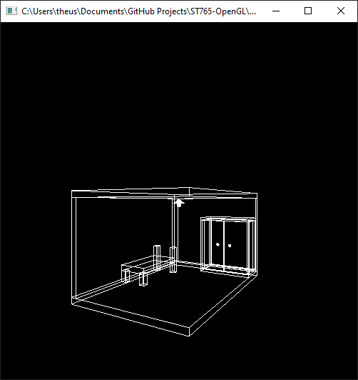

# Metadados
 * **_Author: Matheus Percário Bruder | RA: 222327_**
 * *Created at: 22/04/2021*
 * *File: "quarto.cpp"*

 ## Exercício - Quarto
  Para o programa "quarto.c" dado a seguir, que simula um quarto de adolescente, inclua um outro tipo de móvel ou objeto (armário, prateleira, luminária, criado-mudo etc).

 ## Resolução
  Para solucionar esse exercício, o móvel escolhido para modelar foi um **armário**, logo, para modelar o armário foi preciso criar cada uma das partes (_portas, fundo, tampo superior, tampo inferior e laterais_). Além disso, para testar a função que gera uma esfera no OpenGL foram modeladas duas maçanetas, uma para cada porta do armário.

  Para finalizar, também foi gerado o teto do quarto, o qual possibilitou incluir uma lâmpada na cena. Fixo ao teto encontra-se um plafon (cone) e uma lâmpada (esfera). Abaixo segue um print da cena gráfica!

  

  **Observação**: *Com o intuito de facilitar a visualização durante o desenvolvimento e modelagem da cena gráfica, gerei uma nova possibilidade de rotação no eixo X. Portanto, para testar, basta clicar no 'X' ou 'x' do seu teclado.*

 ---
 ## Código fonte
 ```C++
#include<stdlib.h>
#include<GL/glut.h>

static int rotx = 0;
static int roty = 0;

void init(void){
  glClearColor (0.0, 0.0, 0.0, 0.0);
}

void display(void){
  glClear (GL_COLOR_BUFFER_BIT);
  glPushMatrix();

  glRotatef ((GLfloat) roty, 0.0, 1.0, 0.0);
  glRotatef ((GLfloat) rotx, 1.0, 0.0, 0.0);

  /* chao */
  glPushMatrix();
  glScalef (4.0, 0.2, 6.0);
  glutWireCube (1.0);
  glPopMatrix();
   
  /* parede esquerda */
  glPushMatrix();
  glTranslatef (-1.9, 1.6, 0.0);
  glScalef (0.2, 3.0, 6.0);
  glutWireCube (1.0);
  glPopMatrix();

/*  parede fundo */
  glPushMatrix();
  glTranslatef (0.0, 1.6, -2.9);
  glScalef (4.0, 3.0, 0.2);
  glutWireCube (1.0);
  glPopMatrix();

/* teto */
  glPushMatrix();
  glTranslatef (0.0, 3.2, 0.0);
  glScalef (4.0, 0.2, 6.0);
  glutWireCube (1.0);
  glPopMatrix();

/* cama */
  glPushMatrix();
  glTranslatef (-1.3, 0.6, 0.0);
  glScalef (1.0, 0.2, 2.0);
  glutWireCube (1.0);
  glPopMatrix();

/* pe cama frente esquerdo*/
  glPushMatrix();
  glTranslatef (-1.7, 0.3, 0.9);
  glScalef (0.2, 0.4, 0.2);
  glutWireCube (1.0);
  glPopMatrix();

/* pe cama frente direito*/
  glPushMatrix();
  glTranslatef (-0.9, 0.3, 0.9);
  glScalef (0.2, 0.4, 0.2);
  glutWireCube (1.0);
  glPopMatrix();

/* pe cama cabeceira esquerdo*/
  glPushMatrix();
  glTranslatef (-1.7, 0.6, -1.1);
  glScalef (0.2, 1.0, 0.2);
  glutWireCube (1.0);
  glPopMatrix();

/* pe cama cabeceira esquerdo*/
  glPushMatrix();
  glTranslatef (-0.9, 0.6, -1.1);
  glScalef (0.2, 1.0, 0.2);
  glutWireCube (1.0);
  glPopMatrix();
  
/* -----------------------------------*/
/* fundo armario - OK*/
  glPushMatrix();
  glTranslatef (1.0, 1.2, -2.75);
  glScalef (2.0, 2.0, 0.1);
  glutWireCube (1.0);
  glPopMatrix();

/* tampo inferior - OK*/
  glPushMatrix();
  glTranslatef (1.0, 0.15, -2.29);
  glScalef (2.0, 0.1, 1.0);
  glutWireCube (1.0);
  glPopMatrix();
  
/* tampo superior armario - OK*/
  glPushMatrix();
  glTranslatef (1.0, 2.25, -2.29);
  glScalef (2.0, 0.1, 1.0);
  glutWireCube (1.0);
  glPopMatrix();

/* porta esquerda armario*/
  glPushMatrix();
  glTranslatef (0.5, 1.2, -1.85);
  glScalef (1.0, 2.0, 0.1);
  glutWireCube (1.0);
  glPopMatrix();
  
/* maçaneta porta esq armario*/
   glPushMatrix ();
   glTranslatef (0.75, 1.25, -1.8); 
   glutWireSphere (0.05, 16, 16);
   glPopMatrix ();
  
/* porta direita armario*/
  glPushMatrix();
  glTranslatef (1.5, 1.2, -1.85);
  glScalef (1.0, 2.0, 0.1);
  glutWireCube (1.0);
  glPopMatrix();

/* maçaneta porta esq armario*/
   glPushMatrix ();
   glTranslatef (1.25, 1.25, -1.8); 
   glutWireSphere (0.05, 16, 16);
   glPopMatrix ();
  
/* lateral esq armario*/
  glPushMatrix();
  glTranslatef (0.05, 1.2, -2.3);
  glScalef (0.1, 2.0, 0.8);
  glutWireCube (1.0);
  glPopMatrix();
  
/* lateral dir armario*/
  glPushMatrix();
  glTranslatef (1.95, 1.2, -2.3);
  glScalef (0.1, 2.0, 0.8);
  glutWireCube (1.0);
  glPopMatrix();
  
/* paflon lampada*/
   glPushMatrix ();
   glTranslatef (0.0, 2.9, 0.0); 
   glRotatef (-90.0, 1.0, 0.0, 0.0);
   glutWireCone (0.2, 0.15, 16, 16);
   glPopMatrix ();

/* maçaneta porta esq armario*/
   glPushMatrix ();
   glTranslatef (0.0, 2.85, 0.0); 
   glutWireSphere (0.075, 16, 16);
   glPopMatrix ();
  
  
  glPopMatrix();
  glutSwapBuffers();
}

void reshape (int w, int h){
  glViewport (0, 0, (GLsizei) w, (GLsizei) h);
  glMatrixMode (GL_PROJECTION);
  glLoadIdentity ();
  gluPerspective(65.0, (GLfloat) w/(GLfloat) h, 1.0, 20.0);
  glMatrixMode(GL_MODELVIEW);
  glLoadIdentity();
  glTranslatef (0.0, -3.0, -10.0);  // Desloca a cena em 3 unidades para baixo!
}
void keyboard(unsigned char key, int x, int y){
  switch (key) {
  case 'r':
    roty = (roty + 5) % 360;
    glutPostRedisplay();
    break;
  case 'R':
    roty = (roty - 5) % 360;
    glutPostRedisplay();
    break;
  case 'x':
    rotx = (rotx + 5) % 360;
    glutPostRedisplay();
    break;  
  case 'X':
    rotx = (rotx - 5) % 360;
    glutPostRedisplay();
    break;  
  case 27: 			// tecla Esc (encerra o programa)
	exit(0);
	break;
  }
}

int main(int argc, char** argv){
  glutInit(&argc, argv);
  glutInitDisplayMode (GLUT_DOUBLE | GLUT_RGB);
  glutInitWindowSize (500, 500); 
  glutInitWindowPosition (100, 100);
  glutCreateWindow (argv[0]);
  init ();
  glutDisplayFunc(display); 
  glutReshapeFunc(reshape);
  glutKeyboardFunc(keyboard);
  glutMainLoop();
  return 0;
}
 ```